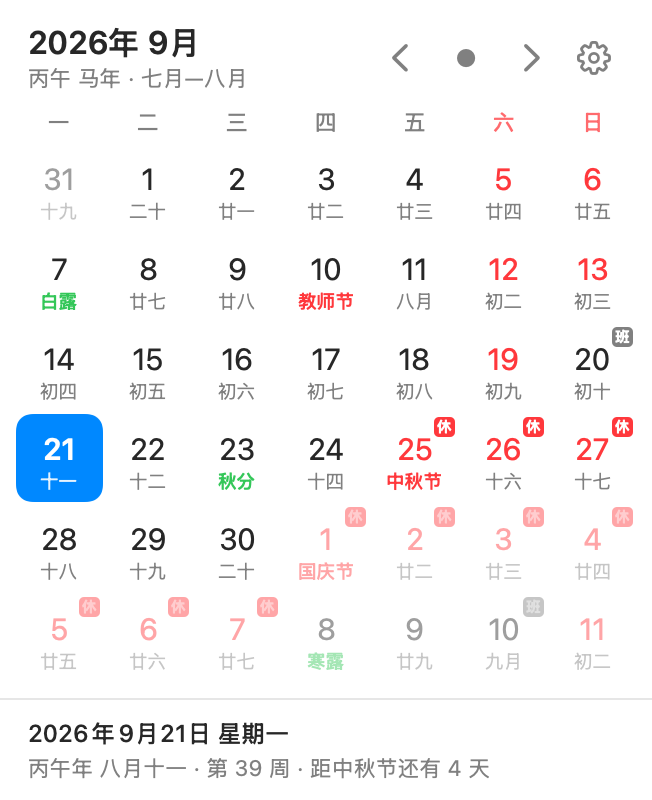
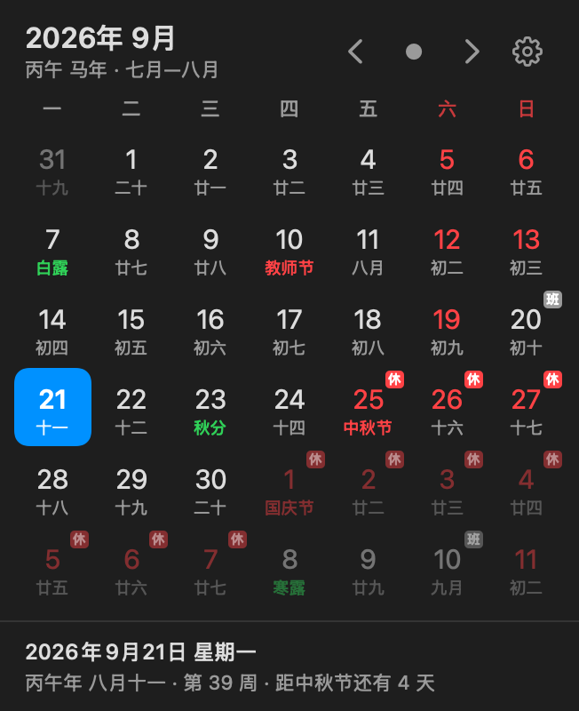

# MenuBarCalendar

A macOS menu bar calendar showing both the Gregorian and the Chinese lunisolar
calendar, with the 24 solar terms, traditional festivals, and China's statutory
holiday arrangement.

<p align="center">
  
  
</p>

## Features

- **Menu bar item** showing a monochrome calendar glyph (the default), a date
  string from a configurable template, or both. Templates render e.g.
  `9月21日 周一` or `八月十一`.
- **Month grid** in a borderless panel flush against the menu bar: Gregorian
  date above, lunar date below, today highlighted, weekends coloured,
  previous/next month dimmed. Clicking a dimmed day jumps to that month.
- **Lunar calendar** from the system's `Calendar(identifier: .chinese)`, with
  sexagenary year, zodiac, leap months, and 除夕 derived from the actual length
  of the twelfth month.
- **24 solar terms** computed from a truncated VSOP87D series, accurate to
  about 10 seconds — enough to place a term like 2026's 雨水 (23:51) on the
  correct day.
- **Statutory holidays and make-up workdays** badged 休 / 班, bundled for
  2025–2026 and refreshable from a public feed.
- **Launch at login**, via `SMAppService` with a LaunchAgent fallback.
- **Appearance** following the system, or forced light or dark for this app's
  own windows.

The dropdown is a borderless `NSPanel` rather than an `NSPopover`: a popover
always draws an anchor arrow, with no public way to hide it, and cannot sit
flush against the menu bar.

## Requirements

- macOS 14 or later
- Swift 6 toolchain (the Command Line Tools are enough; Xcode is not required)

## Build

```sh
./scripts/build_app.sh           # universal (arm64 + x86_64) -> dist/MenuBarCalendar.app
./scripts/build_app.sh --native  # host architecture only, faster
```

Then drag `dist/MenuBarCalendar.app` into `/Applications`.

The build is ad-hoc signed and not notarized, so Gatekeeper will block the
first launch. Either right-click the app and choose **Open**, or clear the
quarantine flag:

```sh
xattr -dr com.apple.quarantine /Applications/MenuBarCalendar.app
```

## Test

```sh
./scripts/run_tests.sh
```

`swift test` is not used: XCTest and swift-testing ship with full Xcode, not
with the Command Line Tools. The tests are compiled directly against the
sources instead, with a small assertion harness in
`Tests/CalendarCoreTests/TestSupport.swift`.

The solar term tests check against published instants from the Purple Mountain
Observatory and cross-check every term against an independent low-accuracy
formula, which catches a mistyped VSOP87 coefficient.

## Preview rendering

```sh
swiftc -O -parse-as-library -module-name CalendarCore -o /tmp/render \
  Sources/CalendarCore/{Lunar,Models,Holidays,Views}/*.swift \
  Sources/MenuBarCalendar/Views/*.swift \
  Sources/MenuBarCalendar/LaunchAtLogin.swift \
  "Sources/MenuBarCalendar/AppAppearance+AppKit.swift" \
  scripts/render_preview.swift
MENUBAR_CALENDAR_HOLIDAYS=Sources/CalendarCore/Resources/holidays.json /tmp/render ./docs
```

Everything is compiled into one module named `CalendarCore`, so the app's
`import CalendarCore` lines only produce an "ignoring import" warning.

Renders the panel off-screen to PNG in both appearances. Note that
`ImageRenderer` cannot draw AppKit-backed controls, so the settings pane
renders as placeholders — check that one in the running app.

## Appearance

The panel and the settings window follow the system theme by default; the
preferences can pin them to light or dark instead. The status item is
deliberately excluded — its template image is tinted by the menu bar, which
follows the system, so forcing it dark under a light menu bar would make the
glyph invisible.

## Manual checks

```sh
dist/MenuBarCalendar.app/Contents/MacOS/MenuBarCalendar --show-on-launch
```

Opens the calendar immediately instead of waiting for a click, which makes the
panel easy to screenshot.

## Data sources

### Solar terms — computed, not fetched

Terms are calculated locally from a truncated VSOP87D series (`SolarTerms.swift`
plus `VSOP87.swift`). Nothing is downloaded, there is no year limit, and the
result does not depend on a third party staying online. Three checks guard it:

1. **Published instants.** Seven terms are compared against Purple Mountain
   Observatory values; agreement is within a minute (in practice ~10 seconds).
2. **An independent formula.** Every term from several years is recomputed with
   the low-accuracy formula from Meeus ch. 25, which shares no coefficients with
   the VSOP87 tables. A mistyped coefficient shows up as a large disagreement.
3. **The leap month rule.** The lunisolar calendar puts a leap month wherever a
   lunar month holds no 中气. All 2412 major terms from 1900 to 2100 are checked
   against ICU's chinese calendar, which shares no code with this series.

A run against [chinese-days](https://github.com/vsme/chinese-days)' bundled
1900–2100 table agrees on 4702 of 4724 terms. The remainder are its own edge
years (1900 and 2100) and cases where it disagrees with the published value —
2000's 大寒 is 21 January 02:23, which is what this code produces.

Note that `Asia/Shanghai` is *not* used for these calculations: the Olson zone
carries China's historical DST (1940–1942, 1946, 1948–1949, 1986–1991), while
the calendar is defined against the 120°E meridian with no daylight saving.
Using the zone moved ten historical terms into the wrong day.

### Statutory holidays — fetched, with fallbacks

The State Council publishes each year's schedule around November of the
preceding year, so this data cannot be computed and the bundled table always
goes stale. `HolidayFeedSource.defaults` tries, in order:

| Source | Notes |
|---|---|
| [holiday-cn](https://github.com/NateScarlet/holiday-cn) via jsDelivr | Pure data repository, updated by CI from the State Council announcements. Serves files straight from the repository, so a commit is live at once. |
| holiday-cn via raw.githubusercontent.com | Same data, second CDN — jsDelivr has been unreachable from mainland China before. |
| [chinese-days](https://github.com/vsme/chinese-days) via jsDelivr | Different project, different schema. Its JSON ships inside an npm package, so updates wait on a release. |

The first source that returns usable data wins, and its payload is normalised
into this app's own shape before caching, so the cache does not depend on which
source answered. A payload is rejected — and the next source tried — when it
fails to parse, reports a different year, or carries no days at all. That last
case is not hypothetical: holiday-cn ships `2027.json` as an empty placeholder
until the announcement lands, and it must not overwrite real data.

Data lands in `~/Library/Application Support/MenuBarCalendar/Holidays`. Launch
checks are throttled to once every 12 hours; the button in preferences forces
one. A year with no data shows no badges, rather than a guess.

## Status bar

The status item shows one of three things, selectable in the preferences:

| Style | Shows |
|---|---|
| `图标` (default) | A template image, tinted by macOS to match the menu bar |
| `文字` | The rendered date template |
| `图标 + 文字` | Both, glyph first |

The glyph is drawn in `StatusItemIcon.swift` rather than reusing `AppIcon.icns`:
status bar images have to be template images so macOS can tint them for light,
dark and highlighted menu bars, which a colour icon cannot do.

The template below applies to the `文字` and `图标 + 文字` styles. Whatever the
style, hovering the status item shows the full date as a tooltip.

| Token | Meaning | Example |
|---|---|---|
| `{y}` `{M}` `{d}` | Gregorian year / month / day | `2026` `9` `21` |
| `{周}` | Weekday | `周一` |
| `{农历}` | Lunar month and day | `八月十一` |
| `{月}` `{日}` | Lunar month / day alone | `八月` `十一` |
| `{节气}` | Solar term, blank on other days | `秋分` |
| `{生肖}` `{干支}` | Zodiac / sexagenary year | `马` `丙午` |

## Layout

```
Sources/CalendarCore/         platform independent; no AppKit or UIKit
  Lunar/                      lunar conversion, solar terms, festivals
  Holidays/                   statutory holiday store + bundled data
  Models/                     view model, grid, preferences, title formatting
  Views/                      SwiftUI: month grid and day cell
Sources/MenuBarCalendar/      the macOS menu bar app
  main.swift                  NSApplication entry point
  AppDelegate.swift
  StatusItemController.swift  status item, panel, settings window, day rollover
  CalendarPanel.swift         borderless dropdown window
  StatusItemIcon.swift        menu bar template glyph
  LaunchAtLogin.swift         SMAppService, with a LaunchAgent fallback
  AppAppearance+AppKit.swift  applies the light/dark choice to NSApp
  Views/                      SwiftUI: calendar panel, settings
scripts/
  build_app.sh                SwiftPM build + bundle assembly + ad-hoc signing
  run_tests.sh                standalone test runner
  make_icon.swift             draws AppIcon.icns
  render_preview.swift        off-screen UI rendering
```

## Contributing

`./scripts/run_tests.sh` must pass before a change is proposed. The lunar,
solar term and holiday logic is covered; the views and the status item
controller are not, so UI changes are checked by running the app.

Code that does not need AppKit belongs in `Sources/CalendarCore`, which is
meant to be shared with an iOS app; it must not import AppKit or UIKit. New
sources there are picked up by the test runner automatically. If a
change touches `VSOP87.swift`, note that the suite cross-checks every term two
independent ways — a single mistyped coefficient will fail the run.

## Acknowledgements

- Statutory holiday data from
  [NateScarlet/holiday-cn](https://github.com/NateScarlet/holiday-cn) (MIT),
  which is also the bundled `holidays.json`, with
  [vsme/chinese-days](https://github.com/vsme/chinese-days) (MIT) as a fallback
  source.
- Solar term calculation follows Jean Meeus, *Astronomical Algorithms*, 2nd ed.,
  using the VSOP87D series for Earth published by the Bureau des Longitudes.
- The lunisolar calendar itself comes from the system's ICU implementation, not
  from a bundled table.

## License

MIT. See [LICENSE](LICENSE).
